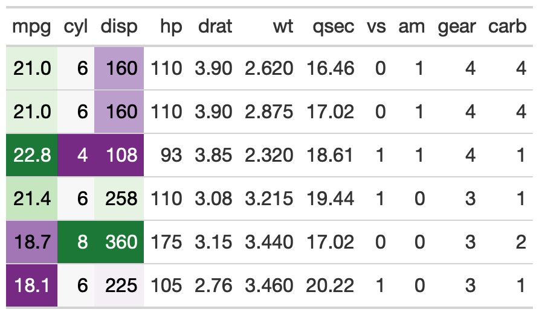
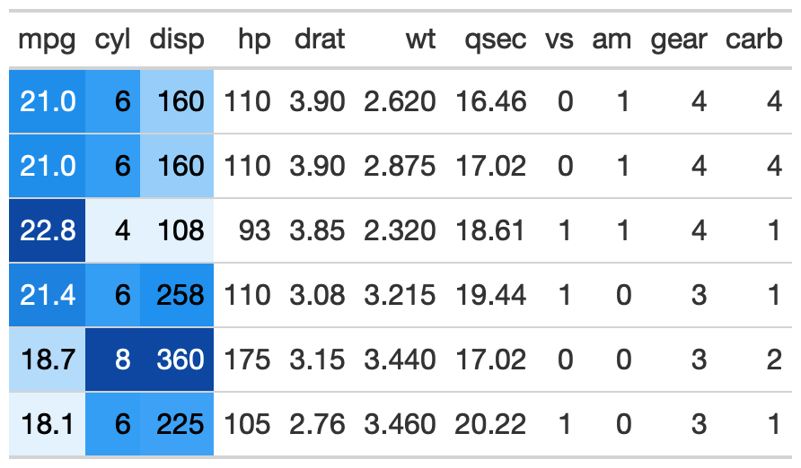
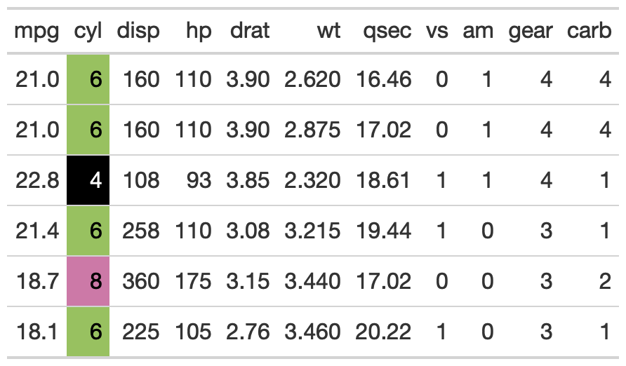
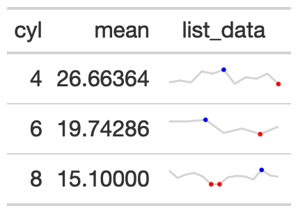
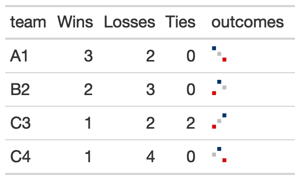
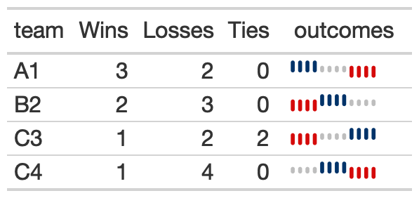
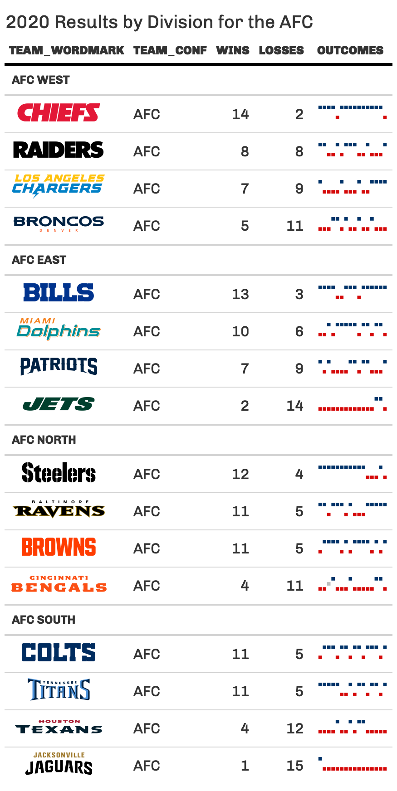
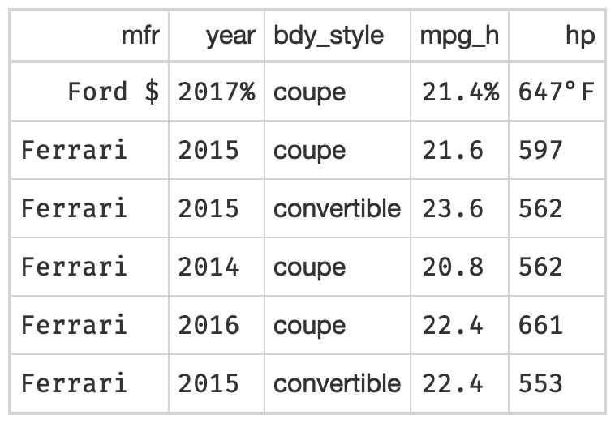

<!-- README.md is generated from README.Rmd. Please edit that file -->

# gtExtras <a href="https://jthomasmock.github.io/gtExtras/"></a>

<!-- badges: start -->

[](https://app.codecov.io/gh/jthomasmock/gtExtras?branch=master)
[](https://github.com/jthomasmock/gtExtras/actions)
[](https://CRAN.R-project.org/package=gtExtras)
[](https://github.com/jthomasmock/gtExtras/actions/workflows/R-CMD-check.yaml)

<!-- badges: end -->

The goal of `{gtExtras}` is to provide some additional helper functions
to assist in creating beautiful tables with `{gt}`.

The functions are generally wrappers around boilerplate or adding
capabilities that are currently not *yet* built into `{gt}`. The [`{gt}`
package](https://gt.rstudio.com/) is amazing, make sure to go read the
official documentation.

## Installation

``` r
install.packages("gtExtras")
```

## Development version

To get a bug fix or to use a feature from the development version, you
can install the development version of gtExtras from
[GitHub](https://github.com/jthomasmock/gtExtras)

``` r
# if needed install.packages("remotes")
remotes::install_github("jthomasmock/gtExtras")
```

There are four families of functions in `gtExtras`:

-   Themes: 7 themes that style almost every element of a `gt` table,
    built off of data journalism-styled tables
-   Utilities: Helper functions for aligning/padding numbers, adding
    `fontawesome` icons, images, highlighting, dividers, styling by
    group, creating two tables or two column layouts, extracting ordered
    data from a `gt` table internals, or generating a random dataset for
    `reprex`
-   Plotting: 12 plotting functions for inline sparklines, win-loss
    charts, distributions (density/histogram), percentiles, dot + bar,
    bar charts, confidence intervals, or summarizing an entire
    dataframe!
-   Colors: 3 functions, a palette for “Hulk” style scale
    (purple/green), coloring rows with good defaults, or adding a “color
    box” along with the cell value

Also see the [Plotting with `gtExtras`
article](https://jthomasmock.github.io/gtExtras/articles/plotting-with-gtExtras.html)
for more examples of combining tables and graphics together.

A subset of functions are included below, or see the full [function
reference](https://jthomasmock.github.io/gtExtras/reference/index.html).

### Themes

The package includes seven different themes, and 3 examples are the
`gt_theme_538()` styled after FiveThirtyEight style tables, the
`gt_theme_espn()` styled after ESPN style tables, and the
`gt_theme_nytimes()` styled after The New York Times tables.

``` r
head(mtcars) %>%
  gt() %>% 
  gt_theme_538()
```

<p align="center">

</p>

``` r
head(mtcars) %>%
  gt() %>% 
  gt_theme_espn()
```

<p align="center">

</p>

``` r
head(mtcars) %>% 
  gt() %>% 
  gt_theme_nytimes() %>% 
  tab_header(title = "Table styled like the NY Times")
```

<p align="center">

</p>

### Hulk data_color

This is an opinionated diverging color palette. It diverges from low to
high as purple to green. It is a good alternative to a red-green
diverging palette as a color-blind friendly palette. The specific colors
come from
[colorbrewer2](https://colorbrewer2.org/#type=diverging&scheme=PRGn&n=7).

Basic usage below, where a specific column is passed.

``` r
# basic use
head(mtcars) %>%
  gt::gt() %>%
  gt_hulk_col_numeric(mpg)
```

<p align="center">

</p>

Trim provides a tighter range of purple/green so the colors are less
pronounced.

``` r
head(mtcars) %>%
  gt::gt() %>%
  # trim gives smaller range of colors
  # so the green and purples are not as dark
  gt_hulk_col_numeric(mpg:disp, trim = TRUE) 
```

<p align="center">

</p>

<!-- width="1200px" -->

Reverse makes higher values represented by purple and lower by green.
The default is to have high = green, low = purple.

``` r
# option to reverse the color palette
# so that purple is higher
head(mtcars) %>%
  gt::gt() %>%
  # reverse = green for low, purple for high
  gt_hulk_col_numeric(mpg:disp, reverse = FALSE) 
```

<p align="center">

</p>

### `gt_color_rows()`

The `gt_color_rows()` function is a thin boilerplate wrapper around
`gt::data_color()`. It’s simpler to use but still provides rich color
choices thanks to the inclusion of `paletteer::paletteer_d()`. This can
provide 100s of discrete (ie categorical) or continuous color palettes.

``` r
# basic use
mtcars %>%
  head() %>%
  gt() %>%
  gt_color_rows(mpg:disp)
```

<p align="center">

</p>

You can change the specific palette with
`palette = "package_name::palette_name"`

``` r
# recognizes all of the dynamic palettes from paletteer
mtcars %>%
  head() %>%
  gt() %>%
  gt_color_rows(mpg:disp, palette = "ggsci::blue_material")
```

<p align="center">

</p>

You can also use custom-defined palettes with named colors in R or hex
color values.

``` r
mtcars %>%
  head() %>%
  gt() %>%
  gt_color_rows(mpg:disp, palette = c("white", "green"))
    # could also use palette = c("#ffffff", "##00FF00")
```

<p align="center">

</p>

Lastly, you can also provide categorical or discrete data to be colored.

``` r
# provide type = "discrete"
mtcars %>%
  head() %>%
  gt() %>%
  gt_color_rows(
    cyl, 
    palette = "ggthemes::colorblind", 
    # note that you can manually define range like c(4, 6, 8)
    domain = range(mtcars$cyl),
    pal_type = "discrete"
   )
```

<p align="center">

</p>

### `gt_highlight_rows()`

This provides the ability to highlight and optionally bold entire rows
within an existing `gt` table. Basic use defaults to a light-blue
highlight which can be changed with the `fill` argument.

``` r
head(mtcars[,1:5]) %>% 
  tibble::rownames_to_column("car") %>% 
  gt() %>% 
  gt_highlight_rows(rows = 2, font_weight = "normal") 
```

<p align="center">

</p>

You can optionally specify a target column with `target_col` that will
be bold, while the rest of the row’s text will be default weight.

``` r
head(mtcars[,1:5]) %>% 
  tibble::rownames_to_column("car") %>% 
  gt() %>% 
  gt_highlight_rows(
    rows = 5, 
    fill = "lightgrey",
    bold_target_only = TRUE,
    target_col = car
    )
```

<p align="center">

</p>

### `gt_sparkline()`

``` r
mtcars %>%
   dplyr::group_by(cyl) %>%
   # must end up with list of data for each row in the input dataframe
   dplyr::summarize(mpg_data = list(mpg), .groups = "drop") %>%
   gt() %>%
   gt_plt_sparkline(mpg_data)
```

<p align="center">

</p>

### `gt_bar_plot()`

The `gt_bar_plot` function takes an existing `gt_tbl` object and adds
horizontal barplots via native HTML. This is a wrapper around raw HTML
strings, `gt::text_transform()` and `gt::cols_align()`. Note that values
default to being normalized to the percent of the maximum observed value
in the specified column. You can turn this off if the values already
represent a percentage value representing 0-100.

``` r
mtcars %>%
  head() %>%
  dplyr::select(cyl, mpg) %>%
  dplyr::mutate(mpg_pct_max = round(mpg/max(mpg) * 100, digits = 2),
                mpg_scaled = mpg/max(mpg) * 100) %>%
  dplyr::mutate(mpg_unscaled = mpg) %>%
  gt() %>%
  gt_plt_bar_pct(column = mpg_scaled, scaled = TRUE) %>%
  gt_plt_bar_pct(column = mpg_unscaled, scaled = FALSE, fill = "blue", background = "lightblue") %>%
  cols_align("center", contains("scale")) %>%
  cols_width(4 ~ px(125),
             5 ~ px(125))
```

<p align="center">

</p>

### `gt_merge_stack()`

The `gt_merge_stack()` function takes an existing `gt` table and merges
column 1 and column 2, stacking column 1’s text on top of column 2’s.
Top text is in all caps with black bold text, while the lower text is
smaller and dark grey.

``` r
team_df <- readRDS(url("https://github.com/nflverse/nflfastR-data/raw/master/teams_colors_logos.rds"))

team_df %>%
  dplyr::select(team_nick, team_abbr, team_conf, team_division, team_wordmark) %>%
  head(8) %>%
  gt(groupname_col = "team_conf") %>%
  gt_merge_stack(col1 = team_nick, col2 = team_division) %>%
  gt_img_rows(team_wordmark)
```

<p align="center">

</p>

### `gt_plt_winloss()`

This function takes a list-column of win loss values (ie, 0=loss, 0.5 =
tie, 1 = win) and ouputs an inline plot representing the win/loss
squares with blue = win, red = loss, grey = tie. Points are also also
redundantly coded with height, where wins are highest, ties are middle,
and losses are at the bottom.

The example below generates an example dataset and then embeds a plot.

``` r
create_input_df <- function(repeats = 3){
  
  input_df <- dplyr::tibble(
    team = c("A1", "B2", "C3", "C4"),
    Wins = c(3, 2, 1, 1),
    Losses = c(2, 3, 2, 4),
    Ties = c(0, 0, 2, 0),
    outcomes = list(
      c(1, .5, 0) %>% rep(each = repeats),
      c(0, 1, 0.5) %>% rep(each = repeats),
      c(0, 0.5, 1) %>% rep(each = repeats),
      c(0.5, 1, 0) %>% rep(each = repeats)
    )
  )
  
  input_df
  
}

create_input_df(5) %>% 
  dplyr::glimpse()
```

    #> create_input_df(5) %>% 
    #>   dplyr::glimpse()
    #>
    #> Rows: 4
    #> Columns: 5
    #> $ team     <chr> "A1", "B2", "C3", "C4"
    #> $ Wins     <dbl> 3, 2, 1, 1
    #> $ Losses   <dbl> 2, 3, 2, 4
    #> $ Ties     <dbl> 0, 0, 2, 0
    #> $ outcomes <list> <1.0, 1.0, 1.0, 1.0, 1.0, 0.5,...

Now that we have way to quickly generate example data, we can show the
ability to incrementally add the win/losses.

Starting with 3 games. **Please ignore the Wins/Loss/Ties columns**, as
they are simply placeholders. I am iterating the length of the outcomes
list row.

``` r
create_input_df(1) %>% 
  gt() %>% 
  gt_plt_winloss(outcomes, max_wins = 15) %>% 
  tab_options(data_row.padding = px(2))
```

<p align="center">

</p>

And moving to 12 games, we can see that the scale is unchanged, and
“empty” points are replaced with outcomes once the values are present in
the data.

``` r
create_input_df(4) %>% 
  gt() %>% 
  gt_plt_winloss(outcomes, max_wins = 15) %>% 
  tab_options(data_row.padding = px(2))
```

<p align="center">

</p>

You can also switch over to ‘squares’ instead of ‘pills’ by changing the
`type` argument.

``` r
create_input_df(4) %>% 
  gt() %>% 
  gt_plt_winloss(outcomes, max_wins = 15, type = "square") %>% 
  tab_options(data_row.padding = px(2))
```

<p align="center">

</p>

A more realistic use case is seen below with data from `{nflreadr}`:

``` r
library(dplyr)
library(tidyr)
library(nflreadr)

games_df <- nflreadr::load_schedules() %>% 
  filter(season == 2020, game_type == "REG") %>% 
  select(game_id, team_home = home_team, team_away = away_team, result, week) %>% 
  pivot_longer(contains('team'), names_to = 'home_away', values_to = 'team', names_prefix = 'team_') %>% 
  mutate(
    result = ifelse(home_away == 'home', result, -result),
    win = ifelse(result == 0 , 0.5, ifelse(result > 0, 1, 0))
  ) %>% 
  select(week, team, win) %>% 
  mutate(
    team = case_when(
      team == 'STL' ~ 'LA',
      team == 'OAK' ~ 'LV',
      team == 'SD' ~ 'LAC',
      T ~ team
    )
  )

team_df <- nflreadr::load_teams() %>% 
  select(team_wordmark, team_abbr, team_conf, team_division)

joined_df <- games_df %>% 
  group_by(team) %>% 
  summarise(
    Wins = length(win[win==1]),
    Losses = length(win[win==0]),
    outcomes = list(win), .groups = "drop") %>% 
  left_join(team_df, by = c("team" = "team_abbr")) %>% 
  select(team_wordmark, team_conf, team_division, Wins:outcomes)

final_df <- joined_df %>% 
  filter(team_conf == "AFC") %>% 
  group_by(team_division) %>% 
  arrange(desc(Wins)) %>% 
  ungroup() %>% 
  arrange(team_division)

final_df %>% 
  gt(groupname_col = "team_division") %>%
  gt_plt_winloss(outcomes, max_wins = 16) %>% 
  gt_img_rows(columns = team_wordmark) %>% 
  gt_theme_538() %>% 
  tab_header(title = "2020 Results by Division for the AFC")
```

<p align="center">

</p>

### `fmt_symbol_first`

This function allows you to format your columns only on the first row,
where remaining rows in that column have whitespace added to the end to
maintain proper alignment.

``` r
library(gtExtras)
library(gt)

gtcars %>%
  head() %>%
  dplyr::select(mfr, year, bdy_style, mpg_h, hp) %>%
  dplyr::mutate(mpg_h = rnorm(n = dplyr::n(), mean = 22, sd = 1)) %>%
  gt::gt() %>%
  gt::opt_table_lines() %>%
  fmt_symbol_first(column = mfr, symbol = "&#x24;", last_row_n = 6) %>%
  fmt_symbol_first(column = year, suffix = "%") %>%
  fmt_symbol_first(column = mpg_h, symbol = "&#37;", decimals = 1) %>%
  fmt_symbol_first(hp, symbol = "&#176;", suffix = "F", symbol_first = TRUE)
```

<p align="center">

</p>

### `pad_fn`

You can use `pad_fn()` with `gt::fmt()` to pad specific columns that
contain numeric values. You will use it when you want to “decimal align”
the values in the column, but not require printing extra trailing
zeroes.

``` r
data.frame(x = c(1.2345, 12.345, 123.45, 1234.5, 12345)) %>%
  gt() %>%
  fmt(fns = function(x){pad_fn(x, nsmall = 4)}) %>%
  tab_style(
    # MUST USE A MONO-SPACED FONT
    style = cell_text(font = google_font("Fira Mono")),
    locations = cells_body(columns = x)
    )
```

<p align="center">

</p>
