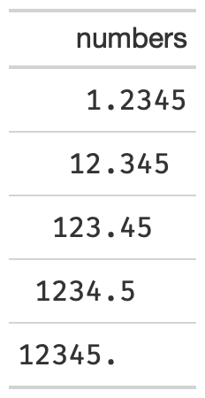

# Format numeric columns to align at decimal point without trailing zeroes

This function removes repeating trailing zeroes and adds blank white
space to align at the decimal point.

## Usage

``` r
fmt_pad_num(gt_object, columns, sep = ".", nsmall = 2, pad0 = FALSE)
```

## Arguments

- gt_object:

  An existing gt table object of class `gt_tbl`

- columns:

  The columns to format. Can either be a series of column names provided
  in [`c()`](https://rdrr.io/r/base/c.html), a vector of column indices,
  or a helper function focused on selections. The select helper
  functions are:
  [`starts_with()`](https://tidyselect.r-lib.org/reference/starts_with.html),
  [`ends_with()`](https://tidyselect.r-lib.org/reference/starts_with.html),
  [`contains()`](https://tidyselect.r-lib.org/reference/starts_with.html),
  [`matches()`](https://tidyselect.r-lib.org/reference/starts_with.html),
  [`one_of()`](https://tidyselect.r-lib.org/reference/one_of.html),
  [`num_range()`](https://tidyselect.r-lib.org/reference/starts_with.html),
  and
  [`everything()`](https://tidyselect.r-lib.org/reference/everything.html).

- sep:

  A character for the separator, typically `"."` or `","`

- nsmall:

  The max number of decimal places to round at/display

- pad0:

  A logical, indicating whether to pad the values with trailing zeros.

## Value

An object of class `gt_tbl`.

## Figures



## Function ID

2-2

## See also

[`pad_fn()`](https://jthomasmock.github.io/gtExtras/reference/pad_fn.md)

Other Utilities:
[`add_text_img()`](https://jthomasmock.github.io/gtExtras/reference/add_text_img.md),
[`fa_icon_repeat()`](https://jthomasmock.github.io/gtExtras/reference/fa_icon_repeat.md),
[`fmt_pct_extra()`](https://jthomasmock.github.io/gtExtras/reference/fmt_pct_extra.md),
[`fmt_symbol_first()`](https://jthomasmock.github.io/gtExtras/reference/fmt_symbol_first.md),
[`generate_df()`](https://jthomasmock.github.io/gtExtras/reference/generate_df.md),
[`gt_add_divider()`](https://jthomasmock.github.io/gtExtras/reference/gt_add_divider.md),
[`gt_badge()`](https://jthomasmock.github.io/gtExtras/reference/gt_badge.md),
[`gt_double_table()`](https://jthomasmock.github.io/gtExtras/reference/gt_double_table.md),
[`gt_duplicate_column()`](https://jthomasmock.github.io/gtExtras/reference/gt_duplicate_column.md),
[`gt_fa_rank_change()`](https://jthomasmock.github.io/gtExtras/reference/gt_fa_rank_change.md),
[`gt_fa_rating()`](https://jthomasmock.github.io/gtExtras/reference/gt_fa_rating.md),
[`gt_highlight_cols()`](https://jthomasmock.github.io/gtExtras/reference/gt_highlight_cols.md),
[`gt_highlight_rows()`](https://jthomasmock.github.io/gtExtras/reference/gt_highlight_rows.md),
[`gt_img_border()`](https://jthomasmock.github.io/gtExtras/reference/gt_img_border.md),
[`gt_img_circle()`](https://jthomasmock.github.io/gtExtras/reference/gt_img_circle.md),
[`gt_img_multi_rows()`](https://jthomasmock.github.io/gtExtras/reference/gt_img_multi_rows.md),
[`gt_img_rows()`](https://jthomasmock.github.io/gtExtras/reference/gt_img_rows.md),
[`gt_index()`](https://jthomasmock.github.io/gtExtras/reference/gt_index.md),
[`gt_merge_stack()`](https://jthomasmock.github.io/gtExtras/reference/gt_merge_stack.md),
[`gt_merge_stack_color()`](https://jthomasmock.github.io/gtExtras/reference/gt_merge_stack_color.md),
[`gt_two_column_layout()`](https://jthomasmock.github.io/gtExtras/reference/gt_two_column_layout.md),
[`gtsave_extra()`](https://jthomasmock.github.io/gtExtras/reference/gtsave_extra.md),
[`img_header()`](https://jthomasmock.github.io/gtExtras/reference/img_header.md),
[`pad_fn()`](https://jthomasmock.github.io/gtExtras/reference/pad_fn.md),
[`tab_style_by_grp()`](https://jthomasmock.github.io/gtExtras/reference/tab_style_by_grp.md)

## Examples

``` r
library(gt)
padded_tab <- data.frame(numbers = c(1.2345, 12.345, 123.45, 1234.5, 12345)) %>%
  gt() %>%
  fmt_pad_num(columns = numbers, nsmall = 4)
```
