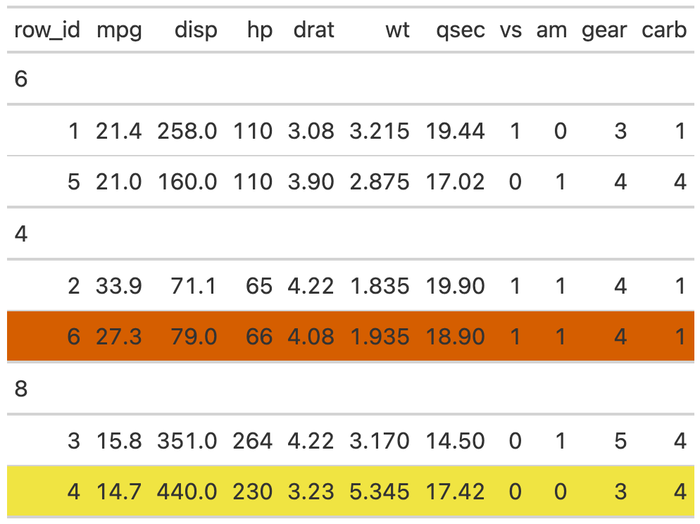

# Get underlying row index for gt tables

Provides underlying row index for grouped or ungrouped `gt` tables. In
some cases the visual representation of specific rows is inconsistent
with the "row number" so this function provides the final output index
for subsetting or targetting rows.

## Usage

``` r
get_row_index(gt_object)
```

## Arguments

- gt_object:

  an existing gt table

## Value

a vector of row indices

## Examples

### Create a helper function

This helper functions lets us be a bit more efficient when showing the
row numbers/colors.

    library(gt)

    row_sty <- function(tab, row){

      OkabeIto <- c("#E69F00", "#56B4E9", "#009E73", "#F0E442",
                    "#0072B2", "#D55E00", "#CC79A7", "#999999")
      tab %>%
        tab_style(
          cell_fill(color = OkabeIto[row]),
          locations = cells_body(rows = row)
        )
    }

### Randomize the data

We will randomly sample the data to get it in a specific order.

    set.seed(37)
    df <- mtcars %>%
      dplyr::group_by(cyl) %>%
      dplyr::slice_sample(n = 2) %>%
      dplyr::ungroup() %>%
      dplyr::slice_sample(n = 6) %>%
      dplyr::mutate(row_id = dplyr::row_number(), .before = 1)

    #> df
    #> A tibble: 6 × 12
    #> row_id  mpg   cyl  disp    hp  drat    wt  qsec    vs    am  gear  carb
    #> <int>  <dbl> <dbl> <dbl> <dbl> <dbl> <dbl> <dbl> <dbl> <dbl> <dbl> <dbl>
    #>   1    10.4   8    472    205  2.93  5.25  18.0     0     0     3     4
    #>   2    18.1   6    225    105  2.76  3.46  20.2     1     0     3     1
    #>   3    21.4   6    258    110  3.08  3.22  19.4     1     0     3     1
    #>   4    13.3   8    350    245  3.73  3.84  15.4     0     0     3     4
    #>   5    33.9   4     71.1  65   4.22  1.84  19.9     1     1     4     1
    #>   6    22.8   4    108    93   3.85  2.32  18.6     1     1     4     1

### Ungrouped data

Ungrouped data works just fine, and the row indices are identical
between the visual representation and the output.

    gt(df) %>%
      row_sty(1) %>%
      row_sty(3) %>%
      row_sty(5)


### Grouped data

However, for grouped data, the row indices are representative of the
underlying data before grouping, leading to some potential confusion.

    tab2 <- gt(df, groupname_col = "cyl")

    tab2 %>%
      row_sty(1) %>% ## actually row 1
      row_sty(3) %>% ## actually row 5
      row_sty(5)     ## actually row 2


The `get_row_index()` function gives ability to create an index of the
final output, so you can reference specific rows by number.

    tab_index <- get_row_index(tab2)

    tab2 %>%
      row_sty(4) %>% ## wrong row, actually row 6 visually
      row_sty(tab_index[4]) ## correct row, actually row 4



    tab2 %>%
      row_sty(tab_index[1]) %>%
      row_sty(tab_index[3]) %>%
      row_sty(tab_index[5])


