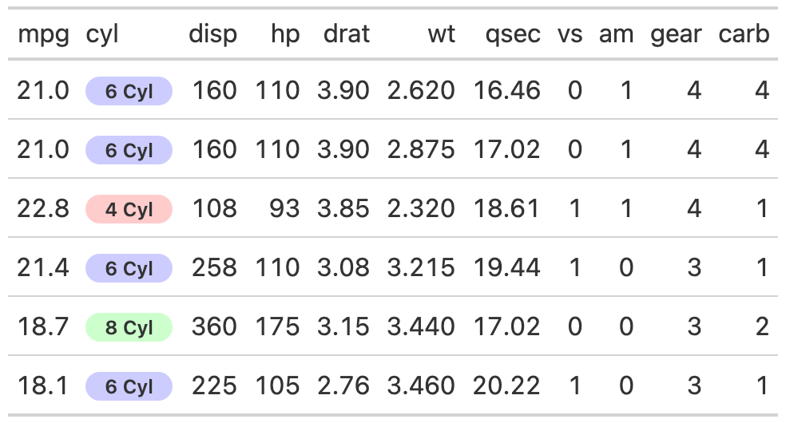

# Add a 'badge' based on values and palette

Add a 'badge' based on values and palette

## Usage

``` r
gt_badge(
  gt_object,
  column,
  palette = NULL,
  alpha = 0.2,
  rows = gt::everything()
)
```

## Arguments

- gt_object:

  An existing `gt` table object

- column:

  The column to convert to badges, accepts `tidyeval`

- palette:

  Name of palette as a string. Must be either length of 1 or a vector of
  valid color names/hex values of equal length to the unique levels of
  the column (ie if there are 4 names, there need to be 4x colors). Note
  that if you would like to specify a specific color to match a specific
  icon, you can also use a named vector like:
  `c("angle-double-up" = "#009E73", "angle-double-down" = "#D55E00","sort" = "#000000")`

- alpha:

  A numeric indicating the alpha/transparency. Range from 0 to 1

- rows:

  The rows to apply the badge to, accepts `tidyeval`. Defaults to all
  rows.

## Value

`gt` table

## Examples

    library(gt)
    head(mtcars) %>%
      dplyr::mutate(cyl = paste(cyl, "Cyl")) %>%
      gt() %>%
      gt_badge(cyl, palette = c("4 Cyl"="red","6 Cyl"="blue","8 Cyl"="green"))

## Figures



## See also

Other Utilities:
[`add_text_img()`](https://jthomasmock.github.io/gtExtras/reference/add_text_img.md),
[`fa_icon_repeat()`](https://jthomasmock.github.io/gtExtras/reference/fa_icon_repeat.md),
[`fmt_pad_num()`](https://jthomasmock.github.io/gtExtras/reference/fmt_pad_num.md),
[`fmt_pct_extra()`](https://jthomasmock.github.io/gtExtras/reference/fmt_pct_extra.md),
[`fmt_symbol_first()`](https://jthomasmock.github.io/gtExtras/reference/fmt_symbol_first.md),
[`generate_df()`](https://jthomasmock.github.io/gtExtras/reference/generate_df.md),
[`gt_add_divider()`](https://jthomasmock.github.io/gtExtras/reference/gt_add_divider.md),
[`gt_double_table()`](https://jthomasmock.github.io/gtExtras/reference/gt_double_table.md),
[`gt_duplicate_column()`](https://jthomasmock.github.io/gtExtras/reference/gt_duplicate_column.md),
[`gt_fa_rank_change()`](https://jthomasmock.github.io/gtExtras/reference/gt_fa_rank_change.md),
[`gt_fa_rating()`](https://jthomasmock.github.io/gtExtras/reference/gt_fa_rating.md),
[`gt_highlight_cols()`](https://jthomasmock.github.io/gtExtras/reference/gt_highlight_cols.md),
[`gt_highlight_rows()`](https://jthomasmock.github.io/gtExtras/reference/gt_highlight_rows.md),
[`gt_img_border()`](https://jthomasmock.github.io/gtExtras/reference/gt_img_border.md),
[`gt_img_circle()`](https://jthomasmock.github.io/gtExtras/reference/gt_img_circle.md),
[`gt_img_multi_rows()`](https://jthomasmock.github.io/gtExtras/reference/gt_img_multi_rows.md),
[`gt_img_rows()`](https://jthomasmock.github.io/gtExtras/reference/gt_img_rows.md),
[`gt_index()`](https://jthomasmock.github.io/gtExtras/reference/gt_index.md),
[`gt_merge_stack()`](https://jthomasmock.github.io/gtExtras/reference/gt_merge_stack.md),
[`gt_merge_stack_color()`](https://jthomasmock.github.io/gtExtras/reference/gt_merge_stack_color.md),
[`gt_two_column_layout()`](https://jthomasmock.github.io/gtExtras/reference/gt_two_column_layout.md),
[`gtsave_extra()`](https://jthomasmock.github.io/gtExtras/reference/gtsave_extra.md),
[`img_header()`](https://jthomasmock.github.io/gtExtras/reference/img_header.md),
[`pad_fn()`](https://jthomasmock.github.io/gtExtras/reference/pad_fn.md),
[`tab_style_by_grp()`](https://jthomasmock.github.io/gtExtras/reference/tab_style_by_grp.md)
