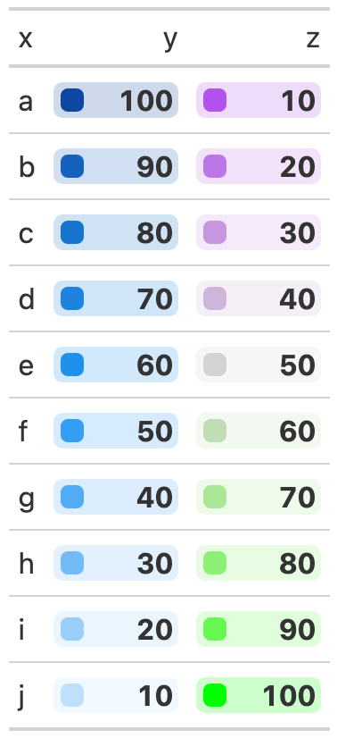

# Add a small color box relative to the cell value.

Create `PFF`-style colorboxes in a `gt` table. Note that rather than
using `gt::fmt_` functions on this column, you can send numeric
formatting arguments via `...`. All arguments should be named and are
passed to
[`scales::label_number()`](https://scales.r-lib.org/reference/label_number.html).

## Usage

``` r
gt_color_box(
  gt_object,
  columns,
  palette = NULL,
  ...,
  domain = NULL,
  width = 70,
  font_weight = "bold"
)
```

## Arguments

- gt_object:

  An existing gt table object of class `gt_tbl`

- columns:

  The columns wherein changes to cell data colors should occur.

- palette:

  The colours or colour function that values will be mapped to. Can be a
  character vector (eg `c("white", "red")` or hex colors) or a named
  palette from the `{paletteer}` package in the `package::palette_name`
  structure. Note that `'pff'` will fill in a blue -\> green -\> yellow
  -\> orange -\> red palette.

- ...:

  Additional arguments passed to
  [`scales::label_number()`](https://scales.r-lib.org/reference/label_number.html),
  primarily used to format the numbers inside the color box

- domain:

  The possible values that can be mapped. This should be a simple
  numeric range (e.g. `c(0, 100)`)

- width:

  The width of the entire coloring area in pixels.

- font_weight:

  A string indicating the font weight, defaults to `"bold"`, change to
  `"normal"` for default weight.

## Value

An object of class `gt_tbl`.

## Examples

    library(gt)
    test_data <- dplyr::tibble(x = letters[1:10],
                        y = seq(100, 10, by = -10),
                        z = seq(10, 100, by = 10))
    color_box_tab <- test_data %>%
      gt() %>%
      gt_color_box(columns = y, domain = 0:100, palette = "ggsci::blue_material") %>%
      gt_color_box(columns = z, domain = 0:100,
                   palette = c("purple", "lightgrey", "green"))

## Figures



## Function ID

4-3

## See also

Other Colors:
[`gt_color_rows()`](https://jthomasmock.github.io/gtExtras/reference/gt_color_rows.md),
[`gt_hulk_col_numeric()`](https://jthomasmock.github.io/gtExtras/reference/gt_hulk_col_numeric.md)
