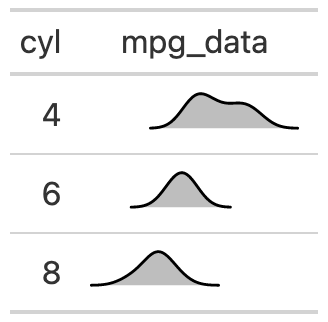

# Add distribution plots into rows of a `gt` table

The `gt_plt_dist` function takes an existing `gt_tbl` object and adds
summary distribution sparklines via `ggplot2`. Note that these
sparklines are limited to density, histogram, boxplot or rug/strip
charts. If you're wanting to plot more traditional spark**lines**, you
can use
[`gtExtras::gt_plt_sparkline()`](https://jthomasmock.github.io/gtExtras/reference/gt_plt_sparkline.md).

## Usage

``` r
gt_plt_dist(
  gt_object,
  column,
  type = "density",
  fig_dim = c(5, 30),
  line_color = "black",
  fill_color = "grey",
  bw = NULL,
  trim = FALSE,
  same_limit = TRUE,
  type_col = NULL
)
```

## Arguments

- gt_object:

  An existing gt table object of class `gt_tbl`

- column:

  The column wherein the sparkline plot should replace existing data.
  Note that the data *must* be represented as a list of numeric values
  ahead of time.

- type:

  A string indicating the type of plot to generate, accepts `"boxplot"`,
  `"histogram"`, `"rug_strip"` or `"density"`.

- fig_dim:

  A vector of two numbers indicating the height/width of the plot in mm
  at a DPI of 25.4, defaults to `c(5,30)`

- line_color:

  Color for the line, defaults to `"black"`. Accepts a named color (eg
  'blue') or a hex color.

- fill_color:

  Color for the fill of histograms/density plots, defaults to `"grey"`.
  Accepts a named color (eg `'blue'`) or a hex color.

- bw:

  The bandwidth or binwidth, passed to
  [`density()`](https://rdrr.io/r/stats/density.html) or
  [`ggplot2::geom_histogram()`](https://ggplot2.tidyverse.org/reference/geom_histogram.html).
  If `type = "density"`, then `bw` is passed to the `bw` argument, if
  `type = "histogram"`, then `bw` is passed to the `binwidth` argument.

- trim:

  A logical indicating whether to trim the values in `type = "density"`
  to a slight expansion beyond the observable range. Can help with long
  tails in `density` plots.

- same_limit:

  A logical indicating that the plots will use the same axis range
  (`TRUE`) or have individual axis ranges (`FALSE`).

- type_col:

  A tidyselect column indicating a vector of which `type` of plot to
  make by row. Must be equal to the total number of rows and limited to
  `"boxplot"`, `"histogram"`, `"rug_strip"` or `"density"`.

## Value

An object of class `gt_tbl`.

## Examples

     library(gt)
     gt_sparkline_tab <- mtcars %>%
        dplyr::group_by(cyl) %>%
        # must end up with list of data for each row in the input dataframe
        dplyr::summarize(mpg_data = list(mpg), .groups = "drop") %>%
        gt() %>%
        gt_plt_dist(mpg_data)

## Figures



## Function ID

1-4

## See also

Other Plotting:
[`gt_plt_bar()`](https://jthomasmock.github.io/gtExtras/reference/gt_plt_bar.md),
[`gt_plt_bar_pct()`](https://jthomasmock.github.io/gtExtras/reference/gt_plt_bar_pct.md),
[`gt_plt_bar_stack()`](https://jthomasmock.github.io/gtExtras/reference/gt_plt_bar_stack.md),
[`gt_plt_percentile()`](https://jthomasmock.github.io/gtExtras/reference/gt_plt_percentile.md),
[`gt_plt_point()`](https://jthomasmock.github.io/gtExtras/reference/gt_plt_point.md),
[`gt_plt_sparkline()`](https://jthomasmock.github.io/gtExtras/reference/gt_plt_sparkline.md),
[`gt_plt_winloss()`](https://jthomasmock.github.io/gtExtras/reference/gt_plt_winloss.md)
