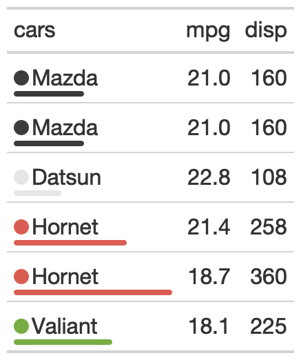

# Add a color dot and thin bar chart to a table

This function takes a data column and a categorical column and adds a
colored dot and a colored dot to the categorical column. You can supply
a specific palette or a palette from the `{paletteer}` package.

## Usage

``` r
gt_plt_dot(
  gt_object,
  column,
  category_column,
  palette = NULL,
  max_value = NULL
)
```

## Arguments

- gt_object:

  An existing gt table object of class `gt_tbl`

- column:

  The column which supplies values to create the inline bar plot

- category_column:

  The category column, where a colored dot and bar will be added

- palette:

  The colors or color function that values will be mapped to. Can be a
  character vector (eg `c("white", "red")` or hex colors) or a named
  palette from the `{paletteer}` package.

- max_value:

  A single numeric value indicating the max value, if left as `NULL`
  then the range of the `column` values will be used

## Value

a `gt_tbl`

## Examples

    library(gt)
    dot_bar_tab <- mtcars %>%
      head() %>%
      dplyr::mutate(cars = sapply(strsplit(rownames(.)," "), `[`, 1)) %>%
      dplyr::select(cars, mpg, disp) %>%
      gt() %>%
      gt_plt_dot(disp, cars, palette = "ggthemes::fivethirtyeight") %>%
      cols_width(cars ~ px(125))

## Figures



## See also

Other Themes:
[`gt_plt_bullet()`](https://jthomasmock.github.io/gtExtras/reference/gt_plt_bullet.md),
[`gt_plt_conf_int()`](https://jthomasmock.github.io/gtExtras/reference/gt_plt_conf_int.md),
[`gt_theme_538()`](https://jthomasmock.github.io/gtExtras/reference/gt_theme_538.md),
[`gt_theme_dark()`](https://jthomasmock.github.io/gtExtras/reference/gt_theme_dark.md),
[`gt_theme_dot_matrix()`](https://jthomasmock.github.io/gtExtras/reference/gt_theme_dot_matrix.md),
[`gt_theme_espn()`](https://jthomasmock.github.io/gtExtras/reference/gt_theme_espn.md),
[`gt_theme_excel()`](https://jthomasmock.github.io/gtExtras/reference/gt_theme_excel.md),
[`gt_theme_guardian()`](https://jthomasmock.github.io/gtExtras/reference/gt_theme_guardian.md),
[`gt_theme_nytimes()`](https://jthomasmock.github.io/gtExtras/reference/gt_theme_nytimes.md),
[`gt_theme_pff()`](https://jthomasmock.github.io/gtExtras/reference/gt_theme_pff.md)
