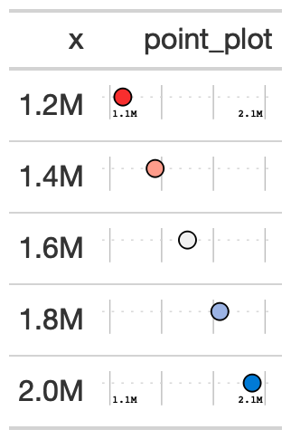

# Create a point plot in place of each value.

Creates a dot/point plot in each row. Can be used as an alternative for
a bar plot. Accepts any range of values, as opposed to
`gt_plt_percentile` which is intended to be used for values between 0
and 100.

## Usage

``` r
gt_plt_point(
  gt_object,
  column,
  palette = c("#007ad6", "#f0f0f0", "#f72e2e"),
  width = 25,
  scale = 1,
  accuracy = 1
)
```

## Arguments

- gt_object:

  An existing gt table

- column:

  The column to transform to the percentile dot plot. Accepts
  `tidyeval`. All values must be end up being between 0 and 100.

- palette:

  A vector of strings of length 3. Defaults to
  `c('blue', 'lightgrey', 'red')` as hex so
  `c("#007ad6", "#f0f0f0", "#f72e2e")`

- width:

  A numeric, indicating the width of the plot in `mm`, defaults to 25

- scale:

  A number to multiply/scale the values in the column by. Defaults to 1,
  but can also be 100 if you have decimals.

- accuracy:

  Accuracy of the number labels in the plot, passed to
  [`scales::label_number()`](https://scales.r-lib.org/reference/label_number.html)

## Value

a gt table

## Examples

    point_tab <- dplyr::tibble(x = c(seq(1.2e6, 2e6, length.out = 5))) %>%
      gt::gt() %>%
      gt_duplicate_column(x,dupe_name = "point_plot") %>%
      gt_plt_point(point_plot, accuracy = .1, width = 25) %>%
      gt::fmt_number(x, suffixing = TRUE, decimals = 1)

## Figures



## Function ID

3-9

## See also

Other Plotting:
[`gt_plt_bar()`](https://jthomasmock.github.io/gtExtras/reference/gt_plt_bar.md),
[`gt_plt_bar_pct()`](https://jthomasmock.github.io/gtExtras/reference/gt_plt_bar_pct.md),
[`gt_plt_bar_stack()`](https://jthomasmock.github.io/gtExtras/reference/gt_plt_bar_stack.md),
[`gt_plt_dist()`](https://jthomasmock.github.io/gtExtras/reference/gt_plt_dist.md),
[`gt_plt_percentile()`](https://jthomasmock.github.io/gtExtras/reference/gt_plt_percentile.md),
[`gt_plt_sparkline()`](https://jthomasmock.github.io/gtExtras/reference/gt_plt_sparkline.md),
[`gt_plt_winloss()`](https://jthomasmock.github.io/gtExtras/reference/gt_plt_winloss.md)
