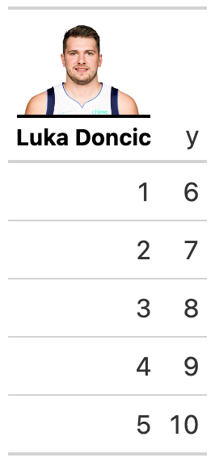

# Add images as the column label for a table

Add images as the column label for a table

## Usage

``` r
img_header(
  label,
  img_url,
  height = 60,
  font_size = 12,
  palette = c("black", "black")
)
```

## Arguments

- label:

  A string indicating the label of the column.

- img_url:

  A string for the image url.

- height:

  A number indicating the height of the image in pixels.

- font_size:

  The font size of the label in pixels.

- palette:

  A vector of two colors, indictating the bottom border color and the
  text color.

## Value

HTML string

## Examples

    library(gt)
    dplyr::tibble(
      x = 1:5, y = 6:10
    ) %>%
      gt() %>%
      cols_label(
        x = img_header(
          "Luka Doncic",
          "https://secure.espn.com/combiner/i?img=/i/headshots/nba/players/full/3945274.png",
          height = 60,
          font_size = 14
        )
      )

## Figures



## See also

Other Utilities:
[`add_text_img()`](https://jthomasmock.github.io/gtExtras/reference/add_text_img.md),
[`fa_icon_repeat()`](https://jthomasmock.github.io/gtExtras/reference/fa_icon_repeat.md),
[`fmt_pad_num()`](https://jthomasmock.github.io/gtExtras/reference/fmt_pad_num.md),
[`fmt_pct_extra()`](https://jthomasmock.github.io/gtExtras/reference/fmt_pct_extra.md),
[`fmt_symbol_first()`](https://jthomasmock.github.io/gtExtras/reference/fmt_symbol_first.md),
[`generate_df()`](https://jthomasmock.github.io/gtExtras/reference/generate_df.md),
[`gt_add_divider()`](https://jthomasmock.github.io/gtExtras/reference/gt_add_divider.md),
[`gt_badge()`](https://jthomasmock.github.io/gtExtras/reference/gt_badge.md),
[`gt_double_table()`](https://jthomasmock.github.io/gtExtras/reference/gt_double_table.md),
[`gt_duplicate_column()`](https://jthomasmock.github.io/gtExtras/reference/gt_duplicate_column.md),
[`gt_fa_rank_change()`](https://jthomasmock.github.io/gtExtras/reference/gt_fa_rank_change.md),
[`gt_fa_rating()`](https://jthomasmock.github.io/gtExtras/reference/gt_fa_rating.md),
[`gt_highlight_cols()`](https://jthomasmock.github.io/gtExtras/reference/gt_highlight_cols.md),
[`gt_highlight_rows()`](https://jthomasmock.github.io/gtExtras/reference/gt_highlight_rows.md),
[`gt_img_border()`](https://jthomasmock.github.io/gtExtras/reference/gt_img_border.md),
[`gt_img_circle()`](https://jthomasmock.github.io/gtExtras/reference/gt_img_circle.md),
[`gt_img_multi_rows()`](https://jthomasmock.github.io/gtExtras/reference/gt_img_multi_rows.md),
[`gt_img_rows()`](https://jthomasmock.github.io/gtExtras/reference/gt_img_rows.md),
[`gt_index()`](https://jthomasmock.github.io/gtExtras/reference/gt_index.md),
[`gt_merge_stack()`](https://jthomasmock.github.io/gtExtras/reference/gt_merge_stack.md),
[`gt_merge_stack_color()`](https://jthomasmock.github.io/gtExtras/reference/gt_merge_stack_color.md),
[`gt_two_column_layout()`](https://jthomasmock.github.io/gtExtras/reference/gt_two_column_layout.md),
[`gtsave_extra()`](https://jthomasmock.github.io/gtExtras/reference/gtsave_extra.md),
[`pad_fn()`](https://jthomasmock.github.io/gtExtras/reference/pad_fn.md),
[`tab_style_by_grp()`](https://jthomasmock.github.io/gtExtras/reference/tab_style_by_grp.md)
