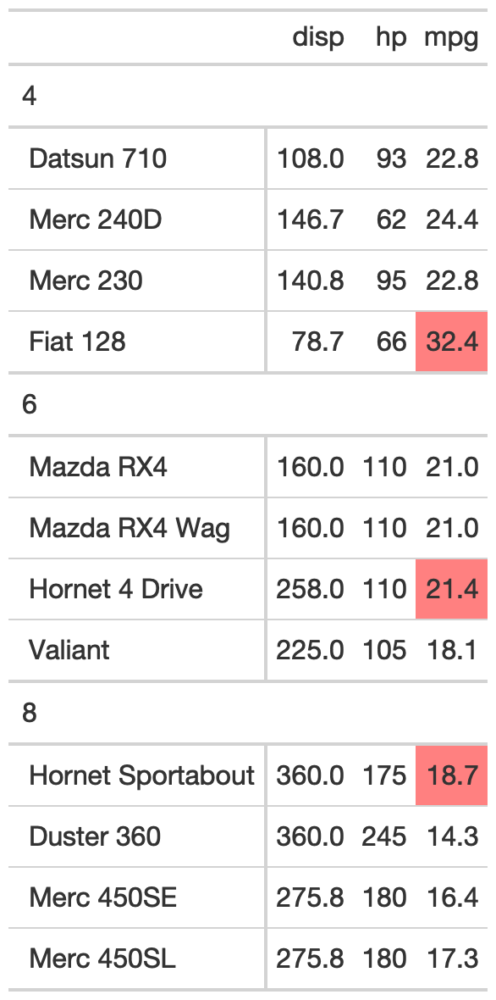

# Add table styling to specific rows by group

The `tab_style_by_grp` function takes an existing `gt_tbl` object and
styling according to each group. Currently it support styling the
[`max()`](https://rdrr.io/r/base/Extremes.html)/[`min()`](https://rdrr.io/r/base/Extremes.html)
for each group.

## Usage

``` r
tab_style_by_grp(gt_object, column, fn, ...)
```

## Arguments

- gt_object:

  An existing gt table object of class `gt_tbl`

- column:

  The column using tidy variable name or a number indicating which
  column should have the styling affect it.

- fn:

  The name of a summarizing function (ie
  [`max()`](https://rdrr.io/r/base/Extremes.html),
  [`min()`](https://rdrr.io/r/base/Extremes.html))

- ...:

  Arguments passed to `tab_style(style = ...)`

## Value

An object of class `gt_tbl`.

## Examples

    library(gt)
    df_in <- mtcars %>%
      dplyr::select(cyl:hp, mpg) %>%
      tibble::rownames_to_column() %>%
      dplyr::group_by(cyl) %>%
      dplyr::slice(1:4) %>%
      dplyr::ungroup()

    test_tab <- df_in %>%
      gt(groupname_col = "cyl") %>%
      tab_style_by_grp(mpg, fn = max,
                       cell_fill(color = "red", alpha = 0.5))

## Figures



## Function ID

2-12

## See also

Other Utilities:
[`add_text_img()`](https://jthomasmock.github.io/gtExtras/reference/add_text_img.md),
[`fa_icon_repeat()`](https://jthomasmock.github.io/gtExtras/reference/fa_icon_repeat.md),
[`fmt_pad_num()`](https://jthomasmock.github.io/gtExtras/reference/fmt_pad_num.md),
[`fmt_pct_extra()`](https://jthomasmock.github.io/gtExtras/reference/fmt_pct_extra.md),
[`fmt_symbol_first()`](https://jthomasmock.github.io/gtExtras/reference/fmt_symbol_first.md),
[`generate_df()`](https://jthomasmock.github.io/gtExtras/reference/generate_df.md),
[`gt_add_divider()`](https://jthomasmock.github.io/gtExtras/reference/gt_add_divider.md),
[`gt_badge()`](https://jthomasmock.github.io/gtExtras/reference/gt_badge.md),
[`gt_double_table()`](https://jthomasmock.github.io/gtExtras/reference/gt_double_table.md),
[`gt_duplicate_column()`](https://jthomasmock.github.io/gtExtras/reference/gt_duplicate_column.md),
[`gt_fa_rank_change()`](https://jthomasmock.github.io/gtExtras/reference/gt_fa_rank_change.md),
[`gt_fa_rating()`](https://jthomasmock.github.io/gtExtras/reference/gt_fa_rating.md),
[`gt_highlight_cols()`](https://jthomasmock.github.io/gtExtras/reference/gt_highlight_cols.md),
[`gt_highlight_rows()`](https://jthomasmock.github.io/gtExtras/reference/gt_highlight_rows.md),
[`gt_img_border()`](https://jthomasmock.github.io/gtExtras/reference/gt_img_border.md),
[`gt_img_circle()`](https://jthomasmock.github.io/gtExtras/reference/gt_img_circle.md),
[`gt_img_multi_rows()`](https://jthomasmock.github.io/gtExtras/reference/gt_img_multi_rows.md),
[`gt_img_rows()`](https://jthomasmock.github.io/gtExtras/reference/gt_img_rows.md),
[`gt_index()`](https://jthomasmock.github.io/gtExtras/reference/gt_index.md),
[`gt_merge_stack()`](https://jthomasmock.github.io/gtExtras/reference/gt_merge_stack.md),
[`gt_merge_stack_color()`](https://jthomasmock.github.io/gtExtras/reference/gt_merge_stack_color.md),
[`gt_two_column_layout()`](https://jthomasmock.github.io/gtExtras/reference/gt_two_column_layout.md),
[`gtsave_extra()`](https://jthomasmock.github.io/gtExtras/reference/gtsave_extra.md),
[`img_header()`](https://jthomasmock.github.io/gtExtras/reference/img_header.md),
[`pad_fn()`](https://jthomasmock.github.io/gtExtras/reference/pad_fn.md)
